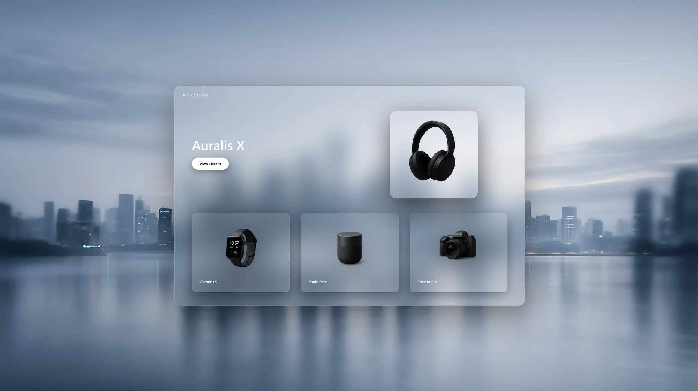

# Mercuria

A luxury storefront built for controlled product presentation

---

## Overview

Mercuria is a high-end product showcase focused on curation, spacing, and visual hierarchy.  
The interface is designed around restraint and pacing, allowing products to stand on their own without UI noise.

---

## Live Demo

https://mercuria.vmoreira.dev

---

## Stack

- React.js  
- Tailwind CSS  
- TypeScript  
- Node.js / Express  
- MongoDB  

---

## Features

- Curated product catalog with refined filtering  
- Luxury-first layout with controlled spacing and pacing  
- Fully responsive grid system  
- Modular component structure for visual consistency  
- High-fidelity UI for presentation-focused experiences  
